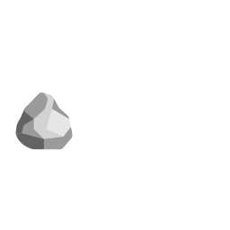

<p align="center">
  
</p>

<p align="center">
    <b>Easy, flexible and high-level scripting wrapper!</b>
</p>

<hr />

<h3>
    🔎 WHAT'S PURPOSE?
</h3>

<p>
    RockWrap is a scripting wrapper written in TypeScript, to simplify some of your work, by using some of high-level methods or create your own server wrapper with this. 
</p>

<p>
    Our wrapper includes custom event system, API to send webhooks to your Discord cannel, methods converted from default slash commands to API and much more!
</p>

<h3>
    🪨 START USING OUR WRAPPER!
</h3>

1. To start using our wrapper, download our repository, then insert it into your scripting folder.
```powershell
your-addon/
├── src/
│   ├── api/
│   │   └── @rockwrap/
│   └── core/
│       └── > Scripts
├── manifest.json
└── > Other files.
```

> [!TIP]
> You can put our wrapper into `api` or `wrapper` folder, for better import readability.

2. Start using our wrapper!
```ts
import { world } from "@minecraft/server";
import { BeforeEvents } from "api/@rockwrap/minecraft";

BeforeEvents.MessageSent(({ message, cancelEvent, player }): void => {
    // Cancels out the event.
    cancelEvent();

    // Override default message.
    world.sendMessage(`§f${player.name} §8» §7${message}`);
});
```

> [!TIP]
> We recommend checking out our [documentation](docs/README.md), to make development with our API even easier!

<hr />

<h3>
    📚 RESOURCES
</h3>

> [!IMPORTANT]
> Documentation: [Documentation](docs/README.md)

> [!TIP]
> Tutorials for beginners: [Tutorials](docs/tutorials/index.md)

<hr />

<h3>
    📌 CONTRIBUTORS
</h3>

<p>
    Here you can find everyone, who helped with wrapper development process.
</p>

- Developer: <a href="https://github.com/syylaxx">syylaxx</a>
- Documentation: <a href="https://github.com/m0lc14kk">m0lc14kk</a>